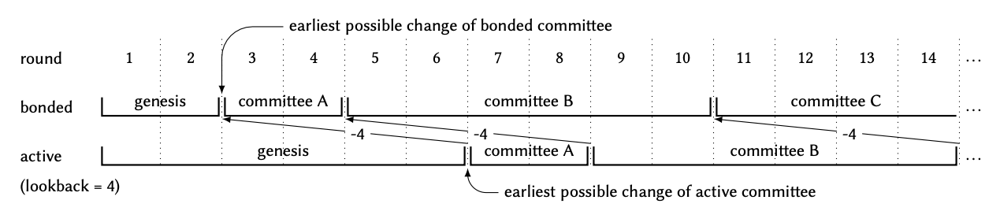

# snarkvm-ledger-committee

The `snarkvm-ledger-committee` crate provides
a data structure and operations for committees.

A _committee_ is a set of validators, each with attributes like stake.
The `Committee` struct in this crate represents a committee.

At any point in time,
a committee is in charge of running the consensus protocol,
i.e. generating and endorsing proposals,
assembling and exchanging certificates,
and so on.
Initially, a known _genesis committee_ is in charge.
The committee changes dynamically, based on
_bonding_ and _unbonding_ transactions:
the former add validators to the committee,
while the latter remove them.
The committee could potentially change at every block,
i.e. every two rounds, since there could be a block every two rounds.

Each validator has its own view of
the committee in charge at every round,
based on its local copy of the blockchain.
Since the protocol guarantees agreement on the blockchain,
validators agree on which committee is in charge at which round.

There are two distinct notions of committee associated to a round:
- The _bonded committee_ at round $r$ is
  the committee resulting from all the bonding and unbonding transactions
  in all the blocks strictly before round $r$,
  starting with the genesis committee.
- The _active committee_ at round $r$ is
  the bonded committee at round $r - \ell$ if $r > \ell$,
  where $\ell$ is the _lookback distance_,
  or the genesis committee if $r \leq \ell$.
  This is the committee in charge of running consensus at round $r$,
  i.e. the committee that is "active" at that round.

If the latest block in the blockchain has round $R$,
the bonded committee
is known for all rounds $r$ such that $1 \leq r \leq R+2$,
but not yet for rounds $r \geq R+3$,
because there could be a new block at round $R+2$
that affects the bonded committee at round $R+3$.
The bonded committee at rounds 1 and 2 is always the genesis committee.
The bonded committee at rounds 3 and 4 could be different,
if there is a block at round 2
and that block contains bonding or unbonding transactions;
otherwise, it is still the genesis committee.
The same pattern applies to subsequent rounds and committees.
Each pair of contiguous odd-even rounds always has the same bonded committee,
which may only change between an even and the subsequent odd round.

While it may seem natural for the bonded committee at round $r$
to be in charge of round $r$,
a validator is often unable to calculate that committee,
when the validator is running consensus for round $r$.
For instance, if $r$ is odd, certificates at round $r$ are needed
to determine whether a block is generated for even round $r-1$ or not.

This problem is solved via a _lookback_ approach:
the active, not bonded, committee at round $r$ is in charge of round $r$.
The rationale is that, with a sufficiently large value of $\ell$,
all validators should have enough blocks to calculate that committee.
The value $\ell$ is the constant `Committee::LOOKBACK_DISTANCE` in the code.
The lookback distance $\ell$ is the delay with which
bonding and unbonding validators actually join and leave consensus.

The following diagram provides an example of bonded and active committees,
with a much smaller lookback distance than normal to keep the diagram small:

The _total stake_ $N$ of a committee is
the sum of the stakes of all its members.
This generalizes the total count of validators in typical BFT systems.

The _maximum faulty stake_ $f$ of a committee is
the maximum sum of the stakes of the faulty members in the committee
that the protocol can tolerate
and still ensure consensus among correct validators.
It is defined as the largest integer $f < N/3$,
where $/$ is exact (rational) division.
(Alternative equivalent definitions are
$f = \lceil N/3 \rceil - 1$ and $f = \lfloor (N-1)/3 \rfloor$.)
This generalizes the maximum count of faulty validators in typical BFT systems.

The _availability stake_ of a committee is defined as $f + 1$.

The _quorum stake_ of a committee is defines as $N - f$.
